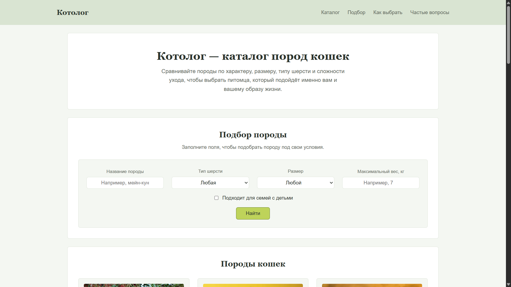
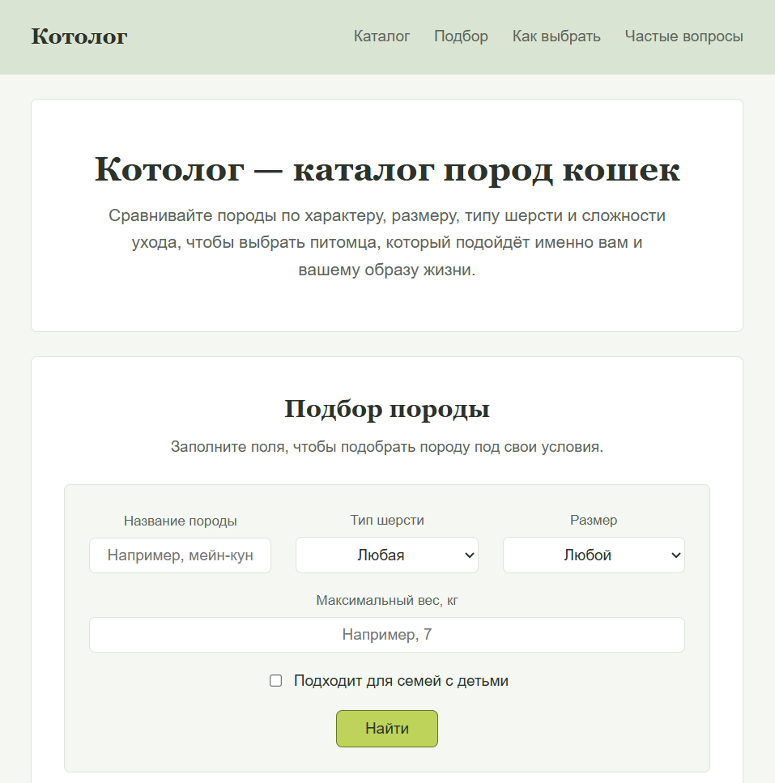
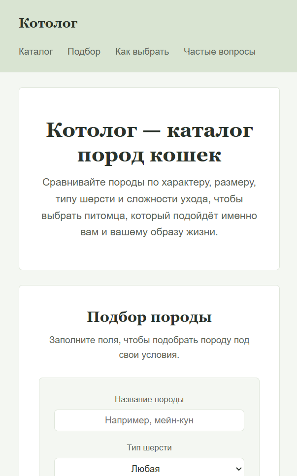
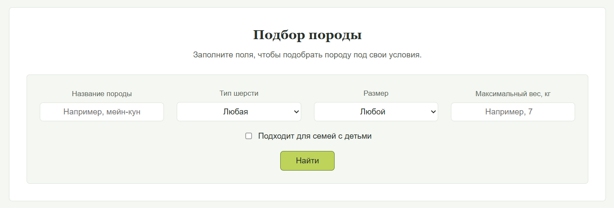
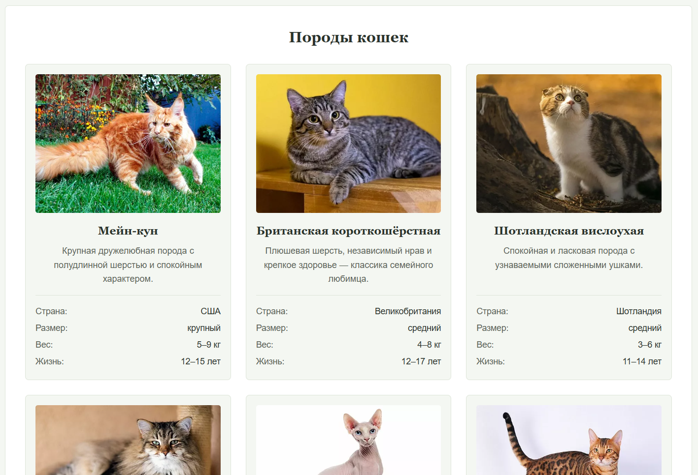
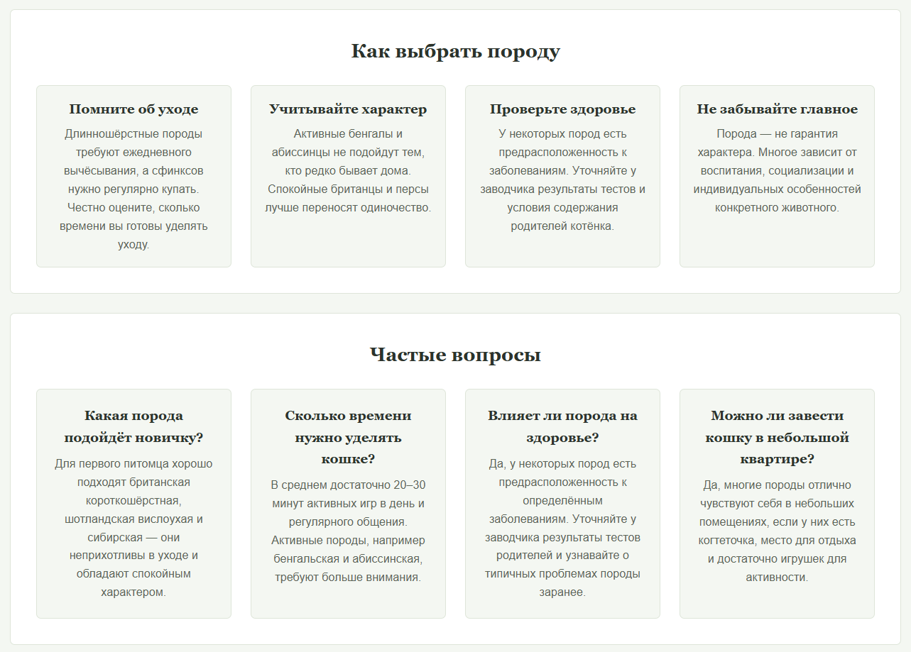

# Отчёт по лабораторной работе № 1

**Тема:** Статическая клиентская часть веб-приложения
**Проект:** «Котолог» — каталог пород кошек
**Выполнил(а):** Стебо Валерия, гр. ИВТ-ИСУ-302Б
**Дата:** 2026

---

## 1. Цель работы

Разработать статическую клиентскую часть будущего веб-приложения
с помощью HTML и CSS: продумать структуру страницы, оформить её
и сделать адаптивной.

---

## 2. Выбранная тема

**«Котолог» — каталог пород кошек.**

Объект коллекции — порода кошки. Для каждой породы указаны:
страна происхождения, размер, вес и продолжительность жизни.
Проект предназначен для людей, которые выбирают первую кошку
или сравнивают несколько пород перед покупкой котёнка.

---

## 3. Структура проекта
web-project/
├── index.html
├── styles/
│ └── main.css
├── assets/
│ └── images/
│ ├── maine-coon.jpg
│ ├── british-shorthair.jpg
│ ├── scottish-fold.jpg
│ ├── siberian.jpg
│ ├── sphynx.jpg
│ ├── bengal.jpg
│ ├── abyssinian.jpg
│ └── persian.jpg
├── README.md
└── REPORT.md

---

## 4. Что сделано

### 4.1. HTML

Создан полноценный HTML-документ `index.html`:

- указаны `<!doctype html>`, `lang="ru"`, кодировка UTF-8,
  метатег `viewport` и осмысленный `title`;
- используется семантическая разметка: `header`, `nav`, `main`,
  `section`, `article`, `footer`;
- каждый смысловой блок имеет заголовок, иерархия заголовков
  выстроена от `h1` к `h3`;
- у каждой карточки есть изображение с осмысленным `alt`,
  название, описание и список характеристик;
- все поля формы имеют связанные подписи `label` (`for` + `id`),
  атрибут `name` и подходящий тип;
- для навигации и формы заданы `aria-label` и `aria-labelledby`.

### 4.2. CSS

Стили вынесены в отдельный файл `styles/main.css`:

- задана единая палитра через CSS-переменные (`:root`);
- выбран читаемый шрифт, единая логика отступов и радиусов;
- карточки пород построены на **CSS Grid**;
- шапка, навигация, форма и подвал построены на **Flexbox**;
- сохранена видимая рамка фокуса через `:focus-visible`;
- добавлены медиазапросы для узкого, среднего и широкого экрана.

---

## 5. Скриншоты

### 5.1. Главная страница при ширине 1280 px

### 5.2. Страница при ширине 768 px

### 5.3. Страница при ширине 360 px

### 5.4. Фильтр пород

### 5.5. Карточки пород

### 5.6. Карточки с информацией о выборе пород

---

## 6. Вывод

В ходе лабораторной работы разработана статическая клиентская
часть веб-приложения «Котолог» — каталог пород кошек. Освоены
семантическая разметка HTML, оформление через CSS, адаптивная
вёрстка с помощью CSS Grid и Flexbox, а также базовые требования
к доступности.
